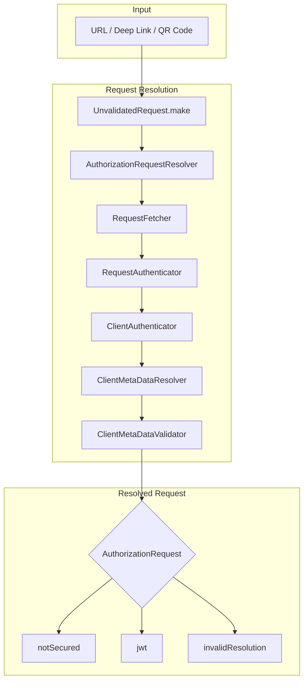
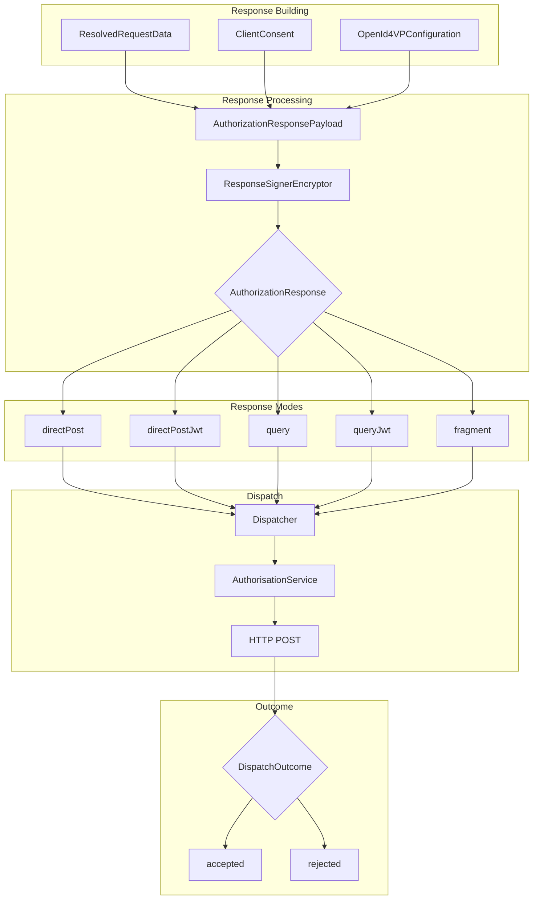
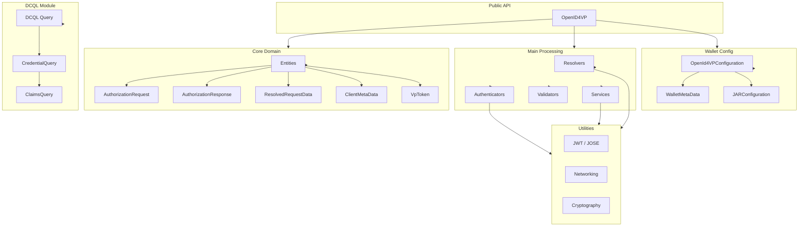
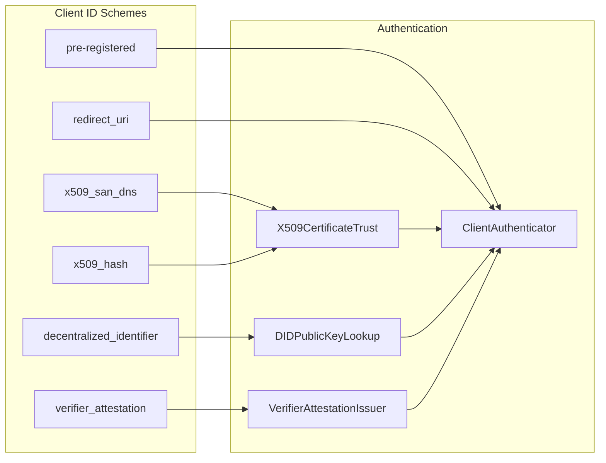
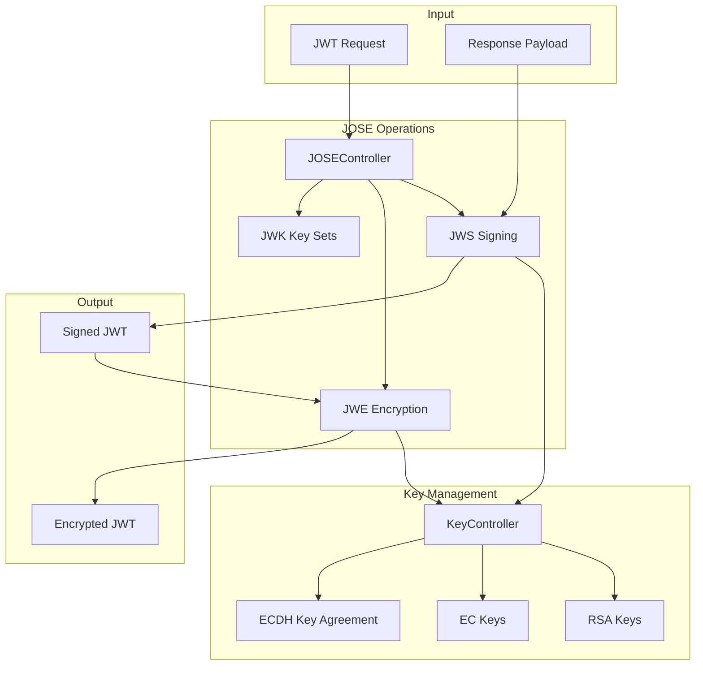
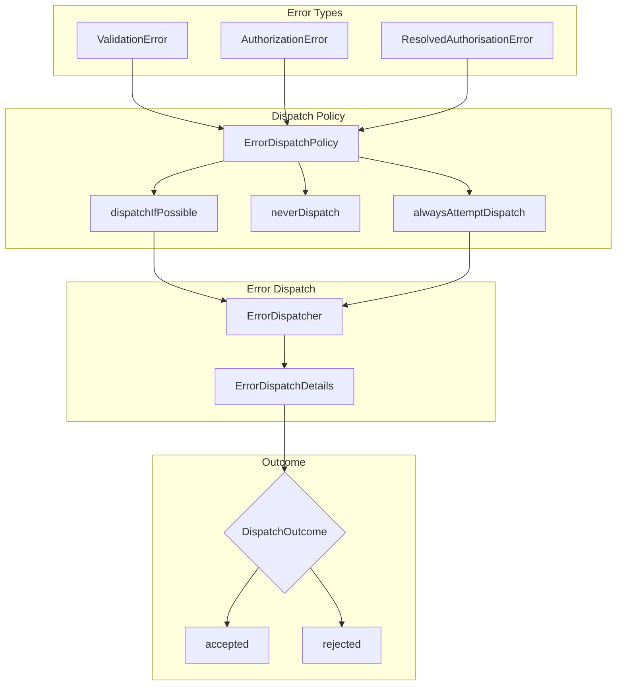
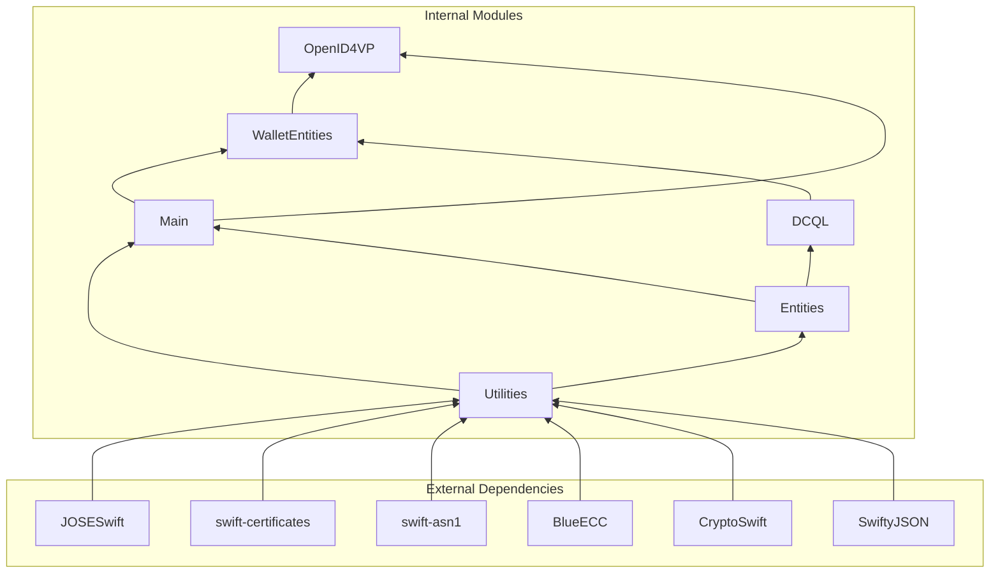

# OpenID4VP Library Architecture

## High-Level Request/Response Flow

## Response Dispatch Flow

## Module Architecture

## Client Authentication Schemes

## JWT & Cryptography Flow

## Error Handling Flow

## Dependency Graph

